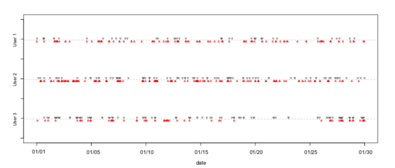
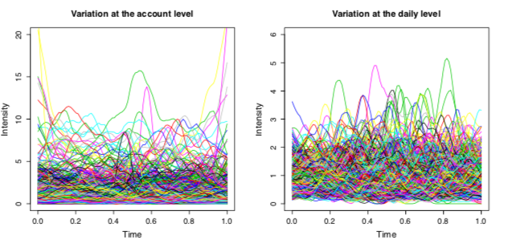
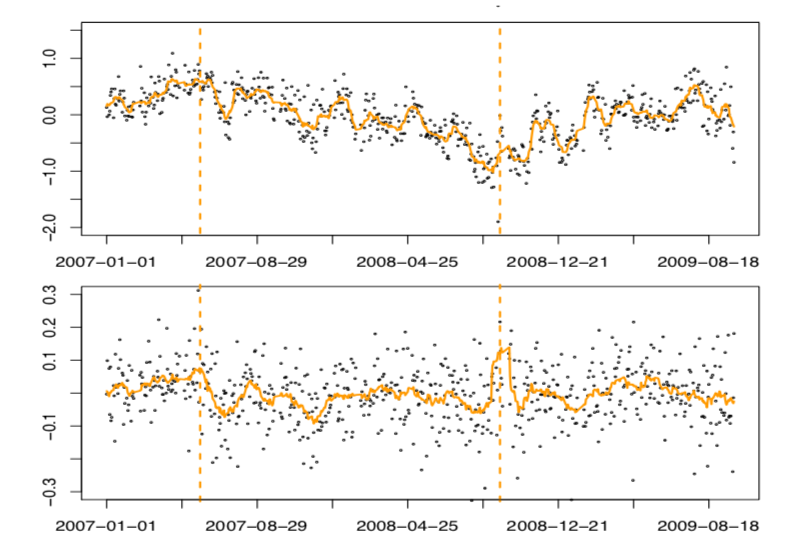

# Semi-parametric-Learning-of-Functional-Point-Process
Research Project;

Project Status: working;

Introduction to the project "Semi-parametric Learning of Functional Point Process",

key words: Functional PCA; multi-level analysis; stock transactions;
 
 ## Abstrct
 
Many factors can affect human activity patterns. For example, in the Stock Trading data, an investor’s trading activities may be affected by three factors, i.e., investor-related characteristics, daily market incentives and their interactions. The proposed model treats the trading times as a univariate/bivariate temporal point process with a random latent intensity function that can be decomposed into three different levels. Variations of the intensity functions both between users and across days will be studied using MFPCA.
 
 ## Brief Introduction to the Project
 ### Project Aims
 To propose a model to describe human activity patterns and develope a method to efficiently fit the proposed model;
 
 To apply the model to investigate the transaction activities of stock investors;
 
 In the project we wan to know:
 
 How do the investor-related characteristics and daily market incentives affect the buying and selling activities of stock investors;
 
 What are the interactions among the stock transactions of different days;
 
 What are the activity patterns of stock-investors within one day;
 
 ### Data Description
The team has access to detailed transaction records (i.e., time stamps of buying/selling stocks at the second level) of 1.2 million stock trading accounts from a national leading brokerage house in China from January 4th, 2007 to September 30th, 2009.
 
 Figure below shows the time stamps for three stock investors in a window of 30 consecutive days; The black points indicate the buying activities on the timeline and the red points indicate the selling activities on the timeline;
 
 
 Figure below: shows the estimated overall trading intensity within a transaction day and the ratios of the estimated trading intensities at the account and day levels relative to the overall trading intensity, based on 1,000 sample accounts over 672 days. It is clear that the trading intensities vary considerably within each 12 day, between accounts, and across different days.
 
 
 
 ### Methodology
 Semi-parametric functional PCA; See [link](https://github.com/LeoYin/Semi-parametric-Learning-of-Functional-Point-Process/blob/main/Methods/Project%20aim%202.pdf).   
 
 
 ### Results
 The Figure below shows the estimations of intensity functions of stock buying (the top figure) and selling (the bottom figure) activities; The line (in orange) is a fitted smoothed line. Three vertical dashed lines from left to right mark May 30th, 2007, September 19th, 2008, the two policy change dates.

 
 
 

